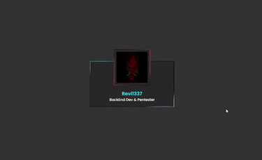

# html-css-single-projects

> Swipe Button

* Reference

``` html
<!-- GoogleAPI -->
<script type="module" src="https://unpkg.com/ionicons@5.5.2/dist/ionicons/ionicons.esm.js"></script>
  <script nomodule src="https://unpkg.com/ionicons@5.5.2/dist/ionicons/ionicons.js"></script>
```

```css 
/* css */
@import url('https://fonts.googleapis.com/css?family=Poppins:200,300,400,500,600,700,800,900&display=swap');
```

* Output (*GIF Maker* https://ezgif.com/)


<br><br>

> Animated Profile

* Reference

```css 
/* css */
@import url('https://fonts.googleapis.com/css?family=Poppins:200,300,400,500,600,700,800,900&display=swap');
```

* Output (*GIF Maker* https://ezgif.com/)



<br><br>

> Animated Login Form

* Reference

```css 
/* css */
@import url('https://fonts.googleapis.com/css?family=Poppins:200,300,400,500,600,700,800,900&display=swap');
```

* Output (*GIF Maker* https://ezgif.com/)


